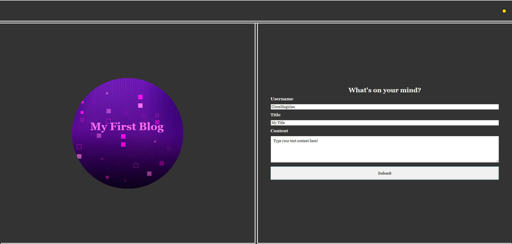

# my-personal-blogpage

Here is my first blogpage website, where you can post your blogs to the site and the data is stored for your use later on. This is achieved using local storage so posts are not saved between browsers and devices.

[Click Here](https://cinosmagician.github.io/my-personal-blogpage/) to view the live webpage

## Usage

Here is how the page looks when first visiting:

Users can enter in a username, a title for their blog and the content they want it to include. Note that all fields must have text as blank fields will not be accecpted.
Users can then press Submit to collect all the data and have it posted as a blog post, along with any previous posts.

Here is how things look after submitting a blog post:

Users can click on the Back button located next to the light/dark mode toggle to return to the first page to post a new blog.

You can also find a link to my portfolio along with (fake) contact information at the bottom of the page.

## Dark Mode

Users will also notice a Moon emoji in the corner, clicking this will toggle into dark mode and change the emoji into a Sun to indicate clicking again will return to light mode. These changes persist between the pages and also persist between refreshes.

Form Page:

Blog Page:

## License

[MIT](https://choosealicense.com/licenses/mit/)
